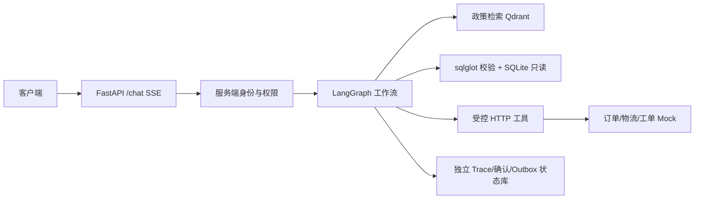

# 智能售后数据 Agent（MVP）

这是一个使用**完全合成数据**的售后演示服务。在同一 `/chat` 会话中，它按问题选择政策检索、SQLite 历史数据查询、实时订单与物流查询，或经用户确认创建工单。接口通过 SSE 返回步骤、工具摘要、答案和引用；订单查询与工单写入都在服务端做身份校验。

## 一键启动

需要 Docker Compose。仓库根目录执行：

```sh
docker compose -f docker/docker-compose.yml up --build -d
docker compose -f docker/docker-compose.yml ps
```

镜像构建时默认以 `MOCK_RANDOM_SEED=20260923` 生成全部合成数据，并执行 `scripts/verify_data_manifest.py`。如覆盖 seed，Compose 会把同一值传入镜像构建和运行环境。核心服务为 `api`、`qdrant` 和 `mock`。就绪后访问：

- API：`http://127.0.0.1:8000`
- 健康检查：`http://127.0.0.1:8000/health?readiness=true`
- Qdrant：`http://127.0.0.1:6333`

Compose 使用三个独立数据卷保存 Qdrant 索引、Agent Trace/确认/Outbox 和 mock 工单。`docker compose ... down` 默认保留数据卷。2026-09-29 已在 Linux 服务器使用 Docker Engine 29.4.3、Compose v5.1.3 实测 `up --build -d`：API 和 mock 的容器健康检查通过，Qdrant `/healthz` 通过，API readiness 的四个组件均为 `up`。运行记录见 [Compose 实测证据](docs/evidence/compose-server/summary.json)和[容器状态](docs/evidence/compose-server/ps.txt)。端口仅绑定服务器本机 `127.0.0.1`，配置与数据均用于合成数据演示。

Linux x86_64 规则网关的离线包、安装步骤和边界见[离线部署手册](docs/离线部署.md)。服务器已生成镜像归档、61 个 wheel 和 SHA256 清单；安装程序校验文件、载入镜像，并以禁止构建和拉取的独立 Compose 栈通过 11 项冒烟，见[离线安装证据](docs/evidence/offline-compose/summary.json)。实测服务器仍联网，物理断网与另一台干净主机安装尚未复验。

服务就绪后可复验合成数据冒烟（会创建一张 mock 工单，并覆盖 `docs/evidence/compose-server/` 中的对应证据）：

```sh
bash scripts/verify_compose.sh
```

## 本地开发

Python 3.12 及 `uv`：

```sh
uv sync --frozen --extra dev
uv run python scripts/generate_seed_data.py
uv run python scripts/verify_data_manifest.py
```

分别启动 mock 与 API（两个终端）：

```sh
uv run uvicorn mock.mock_server:app --host 127.0.0.1 --port 8081 --no-access-log
uv run uvicorn api.main:app --host 127.0.0.1 --port 8000 --no-access-log
```

本地默认 `QDRANT_URL=:memory:`，API 启动时从 `knowledge/source/` 入库，无需额外 Qdrant 进程。Compose 则连接持久化 Qdrant。数据清单位于 `data_manifest.json`，包括固定种子、文件哈希、记录数与演示订单。原始 `orders.jsonl` 有 200 条，其中 190 条有效记录进入 `ecommerce.db`，10 条异常记录保存在 `rejected_orders.jsonl`；另有 30 篇带版本的政策文档和 50 条合成多轮对话。

开发/测试环境的“上个月”“本月”等相对月份以 `data_manifest.json` 的 `generated_at` 为分析基准（默认 `2026-09-23T12:00:00+08:00`），确保数据查询可复现。可通过 `DATA_REFERENCE_TIME` 指定带时区的 ISO 8601 时间覆盖该基准。Mock 返回的 `observed_at` 是实际接口观测时间，订单和物流对象中的 `updated_at` 是合成数据的状态更新时间，两者含义不同。

## 调用示例

开发环境演示凭证：`demo-user-a` 对应 `user_a`，`demo-user-b` 对应 `user_b`，`demo-admin` 只用于查看 Trace。`O00001` 属于 `user_a` 且状态为退款失败；`O00002` 属于 `user_b`，可用于验证跨用户拒绝。

```sh
curl -N -X POST http://127.0.0.1:8000/chat \
  -H 'Authorization: Bearer demo-user-a' \
  -H 'Content-Type: application/json' \
  -d '{"conversation_id":"demo_001","message":"订单 O00001 的退款进度是什么？","metadata":{"channel":"web"}}'
```

Windows PowerShell 使用单行命令：

```powershell
curl.exe -N -X POST http://127.0.0.1:8000/chat -H 'Authorization: Bearer demo-user-a' -H 'Content-Type: application/json' --data-raw '{"conversation_id":"demo_001","message":"订单 O00001 的退款进度是什么？","metadata":{"channel":"web"}}'
```

可将 `message` 改为“退货政策是什么？”、“我上个月消费了多少元？”或“订单 O00001 的物流到哪了？”。SSE 事件包括 `step.started`、`tool.started`、`tool.completed`、`action.preview`、`message.delta`、`done` 和错误事件；不会输出模型内部推理。

退款失败等异常订单会先返回 `action.preview`。复制其 `action_id`，在**同一** `conversation_id` 的下一轮明确确认：

```json
{
  "conversation_id": "demo_001",
  "message": "",
  "action": {"action_id": "act_从预览事件复制", "decision": "confirm"}
}
```

取消时使用 `decision: "cancel"`。客户端只提交 `action_id` 和决定，不重传订单号、工单类型或摘要；服务端读取已保存的参数快照。重复确认依赖幂等键返回相同结果。上游持续故障时返回待提交状态，并由独立 Outbox 重试。

查询 Trace 时使用 SSE `done` 事件中的 `trace_id`：

```sh
curl -H 'Authorization: Bearer demo-admin' \
  http://127.0.0.1:8000/internal/traces/TRACE_ID
```

仓库附有一条合成订单请求的脱敏调用链：[Trace JSON](docs/evidence/trace-demo.json)、[可阅读的 HTML 视图](docs/evidence/trace-demo.html)和[视图截图](docs/evidence/trace-demo.png)。样例由进程内实际调用 `/chat`、再以演示管理员身份读取受保护 Trace 生成；截图展示该导出视图。运行 `uv run python -m scripts.export_demo_trace` 可重新生成 JSON 和 HTML。Linux Compose 实测还保存了[服务端工单 Trace](docs/evidence/compose-server/trace.json)、[SQL Trace](docs/evidence/compose-server/sql-trace.json)和政策、SQL、订单授权、缺参澄清、工单确认与重复确认的 HTTP/SSE 证据。录屏仍在实施文档的交付要求中，优先级较低；目前尚未制作，现有记录和截图可用于逐项核查。

`/metrics` 需要 `X-Metrics-Token` 请求头；开发默认值是 `demo-metrics-token`。当前版本仅用于演示，`APP_ENV=production` 会因尚未接入真实认证适配器而拒绝启动。`/health` 支持 `?readiness=true`，未就绪时返回 503。

## 架构与安全边界



静态政策来自 Qdrant 文档，历史统计来自只读 SQLite，当前订单与物流来自 mock API。SQL 经 AST 白名单、对象级过滤、绑定参数、行数与执行时间限制后才可执行；工具只接受固定的业务参数。身份、权限、脱敏和工单确认由确定性代码负责。Qdrant 使用本地确定性字符 n-gram 向量，默认模型网关用规则完成意图路由和 SQL 模板选择；这两项便于复现 MVP，不代表生产检索或自然语言理解质量。

| 组件 | 选择原因 |
| --- | --- |
| FastAPI + SSE | 异步请求与可审计事件流 |
| LangGraph | 明确的路由、取证、工具与确认状态 |
| Qdrant | 政策段落向量索引及元数据过滤 |
| SQLite + sqlglot | 合成历史数据与 AST 只读校验 |
| httpx | 工具超时、重试和故障降级 |
| 独立运行时 SQLite | Trace、一次性动作、幂等结果和 Outbox 持久化 |

详细数据流见 [架构设计](docs/架构设计.md)，部署配置见 [部署手册](docs/部署手册.md)。

## 配置、测试与评测

配置从环境变量或项目根目录的 `.env` 读取。先复制 `.env.example` 为 `.env`，再把模型地址、模型名和密钥填入 `.env`；`.env.example` 仅作空白模板，不要在其中保存真实密钥。常用项：

| 变量 | 开发默认值 | 说明 |
| --- | --- | --- |
| `APP_ENV` | `development` | 当前 `production` 会拒绝启动，直到接入真实认证适配器 |
| `MOCK_RANDOM_SEED` | `20260923` | 合成数据固定种子 |
| `DATA_REFERENCE_TIME` | 空，读取 manifest | 开发/测试相对月份的分析基准，可填带时区的 ISO 8601 时间 |
| `DATABASE_PATH` | `database/ecommerce.db` | SQLite 业务库，只读访问 |
| `STATE_DB_PATH` | `runtime/agent_state.db` | Trace、确认和 Outbox |
| `QDRANT_URL` | `:memory:` | Compose 中为 `http://qdrant:6333` |
| `MOCK_SERVER_URL` | `http://127.0.0.1:8081` | Compose 中为 `http://mock:8081` |
| `MOCK_INTERNAL_KEY` | 演示值 | Agent 到 mock 的内部服务密钥 |
| `METRICS_TOKEN` | 演示值 | `/metrics` 访问令牌 |
| `LLM_PROVIDER` | `rules` | `rules` 或 `openai_compatible` |

`openai_compatible` 需要设置 `LLM_BASE_URL`（以 `/v1` 结尾）、`LLM_MODEL`，以及在需要时设置 `LLM_API_KEY`；同一接口可以指向公网兼容服务或本地 vLLM。当前适配器会生成经 Pydantic 校验的结构化路由，也会生成 SQL 候选；缺参和授权仍由服务端处理。切换模型后须重跑路由、SQL、安全与答案评测。更换密钥不能单独启用生产模式：先实现真实认证适配器，再完成生产部署校验。不要提交 `.env`、密钥或真实客服数据。

Linux 演示服务器的配置文件位于 `/root/aftersales-mvp-20260929/.env`。已有应用镜像时，在该目录使用 `docker compose --env-file .env -f docker/docker-compose.yml up -d --no-build` 可按配置启动。源码包不会携带 `.env`。服务器目前已验证模型接口连通与 API readiness；真实模型的业务评测结果见下文。

可用 `uv run python eval/eval.py --in-process --use-configured-model --case sql_spend_a` 先做隔离的真实端点试验；报告写入被忽略的 `runtime/eval/`，不会覆盖默认规则网关的 Golden 基线。

```sh
uv run --extra dev pytest -q
uv run --extra dev ruff check .
uv run --extra dev black --check .
uv run python scripts/verify_data_manifest.py
uv run python scripts/scan_synthetic_logs.py
uv run python eval/eval.py --in-process
```

本机验证：78 条 pytest 用例通过，Black 与 Ruff 检查通过，固定 seed 重新生成和清单对比通过。2026-10-08，49 条 Golden 用例在 `--in-process` 模式下全部通过，关键安全失败为 0；业务库运行前后原始文件 SHA256 一致。Golden 还绑定 SQLite 逻辑数据 SHA256，跨 Windows/Linux 构建时可核对同一业务数据；运行前后原始文件 SHA256 用于验证只读。结果见[评测报告](eval/报告.md)和[机器可读结果](eval/results.json)。同日 Linux Compose 外部 HTTP 评测为 46 通过、0 失败、3 跳过、0 关键安全失败；所有已评门槛分项通过，但因公开接口无法开启 429、500 和超时故障注入，发布门槛状态为 `incomplete`。这 3 条场景已由进程内 49/49 评测覆盖。见[服务器评测报告](docs/evidence/compose-server/eval-report.md)。生产容量与所选真实模型仍需另行验收。

### Golden 评测指标

| 指标 | 确认门槛 | 进程内（2026-10-08） | Linux Compose HTTP（2026-10-08） |
| --- | ---: | ---: | ---: |
| 用例结果 | — | 49 通过 / 0 失败 / 0 跳过 | 46 通过 / 0 失败 / 3 跳过 |
| 路由准确率 | 观察 | 48/48（100%） | 45/45（100%） |
| Answer Relevancy（事实覆盖代理） | ≥85% | 61/61（100%） | 58/58（100%） |
| Faithfulness（引用与禁用事实代理） | ≥90% | 66/66（100%） | 66/66（100%） |
| Tool call Accuracy | ≥95% | 57/57（100%） | 45/45（100%） |
| 数值准确率 | ≥98% | 9/9（100%） | 9/9（100%） |
| 引用准确率 | ≥95% | 20/20（100%） | 20/20（100%） |
| SQL 可执行准确率 | ≥90% | 10/10（100%） | 10/10（100%） |
| 注入与越权拦截率 | 100% | 7/7（100%） | 7/7（100%） |
| SSE 协议通过率 | 观察 | 53/53（100%） | 50/50（100%） |
| 未确认写操作 | 0 | 0/50 | 0/44 |
| PII、密钥或跨用户数据泄露 | 0 | 0/52 | 0/49 |
| 重复建单 | 0 | 0/3 | 0/1 |
| 发布门槛 | 全部达到 | `passed` | `incomplete`（3 条跳过） |

分母是各指标实际执行的检查次数，不是 49 条用例总数；安全三行按“违规/已检查”计数。HTTP 的 `incomplete` 仅因 3 条故障注入用例跳过，已执行用例失败 0、安全失败 0；进程内评测覆盖了 429、500 和超时。事实覆盖与忠实性为合成数据上的确定性代理检查，不等同于开放式语义模型评分，也不能外推为真实客户问题或真实模型的效果。原始结果见[进程内报告](eval/报告.md)和[服务器 HTTP 报告](docs/evidence/compose-server/eval-report.md)。

上述指标来自默认规则网关。真实兼容模型 API 已在本机隔离环境完成 6 条合成用例试验，4 条通过、2 条路由失败。随后在 Linux 服务器同样进行了实验。服务器外部 HTTP 最终复测 6 条通过 4 条、失败 2 条（消费统计误判工单，订单查询 20 秒超时），关键安全失败 0、`release_gate=failed`。真实模型尚未通过验收，本地模型端点尚未提供；详见[真实 API 试验记录](docs/evidence/model-api/README.md)和[服务器最终报告](docs/evidence/model-api/server-final-report.md)。

当前限制与验证状态见 [已知问题与风险](docs/已知问题与风险.md)，常见操作见 [FAQ](docs/FAQ.md)。
