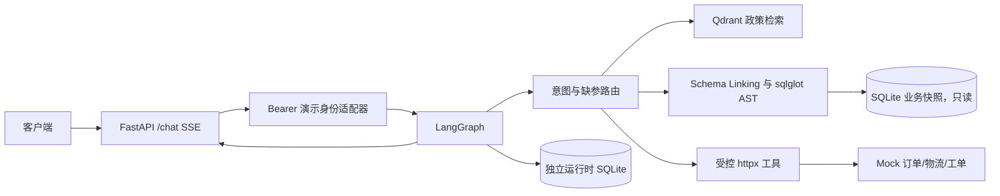
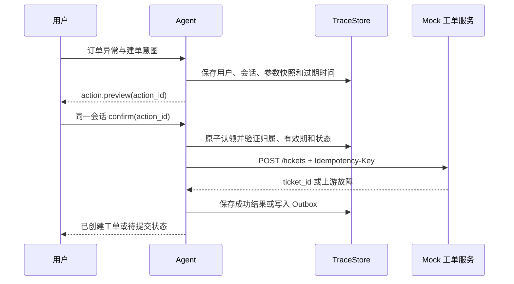

# 架构设计

## 目标与边界

MVP 在单个会话中处理政策、历史统计、当前订单/物流与工单。政策文档和订单都是合成的；SQLite 只用于历史快照，mock API 用于实时查询和工单。客户端提供 `conversation_id`、消息以及工单确认决定；身份、租户、授权范围和确认参数快照由服务端维护。

## 请求流程

1. `/chat` 在 SSE 开始前检查固定演示 Bearer Token，建立不可由用户消息覆盖的 `principal_id`、`tenant_id`、scopes。
2. LangGraph 路由到澄清、RAG、SQL 或工具节点；缺订单号时直接澄清。
3. RAG 只使用当前已生效政策段落，按 `policy_key` 和版本日期裁决，答案附文档名、段落号和生效日期。
4. SQL 生成候选查询后，通过 sqlglot 检查只读语法、表列白名单和对象级授权，再用只读 SQLite 连接执行。金额保存在 `amount_cents` 整数列，回答换算为 CNY 元。
5. 工具仅调用固定的 mock 路由，并再次验证订单归属。查询物流前先查询订单；429、超时、5xx 在截止时间内有界重试。
6. 服务端组合事实和引用，SSE 输出可审计步骤、答案增量、警告和 `done`；TraceStore 记录脱敏链路。

## 数据契约

生成器 `scripts/generate_seed_data.py` 以固定 seed 产生 `orders.jsonl`、`ecommerce.db`、30 篇知识文档、50 条合成对话和 `data_manifest.json`。200 条原始订单中 10 条故意异常，进入 `rejected_orders.jsonl`，190 条有效记录进入数据库。`verify_data_manifest.py` 核对哈希、计数、拒收记录、外键、知识版本和固定演示订单。

开发/测试环境的相对月份以 manifest 的 `generated_at` 计算，默认 `2026-09-23T12:00:00+08:00`；`DATA_REFERENCE_TIME` 可覆盖为带时区时间。Mock 订单响应的 `observed_at` 是实际请求观测时间，业务记录的 `updated_at` 是合成快照时间。

三张核心表为 `orders`、`logistics`、`products`。`orders.user_id` 和 `tenant_id` 是对象级授权字段；物流必须通过订单验证归属。订单与物流状态字典在 `database/schema_catalog.yaml` 中。知识源文件包含 `policy_key`、`effective_date`、`version`、`category`、`is_current`，段落使用稳定 `[p-001]` 格式。RAG 入库使用确定性字符 n-gram 向量，便于离线复现。

## 工单确认与幂等

客户端不能在确认请求中重传或修改工具参数。mock 服务使用独立工单库和唯一幂等键；同一请求重放返回同一工单，不同请求复用幂等键返回 409。上游失败时，Agent 仅在 Outbox 成功写入后报告待提交，后台按原 action_id 重试。业务 SQLite 始终不承载工单写入。

## 安全与可观测

- 用户消息、知识文档、数据库值与工具响应均为不可信数据。检索到的文字只能作为证据，不能改变路由权限或直接发起工单。
- SQL 边界由 AST 校验、参数绑定、`mode=ro`、`PRAGMA query_only=ON`、结果行上限和执行截止时间共同组成。授权由确定性代码注入并复核。
- `/metrics` 使用独立运维令牌；`/internal/traces/{trace_id}` 限管理员演示令牌。PII/密钥在 SSE 与 Trace 前统一脱敏。
- `step.started`、`tool.completed`、`action.preview` 等 SSE 事件只包含步骤和摘要，不发送隐式推理链。

## 运行形态

Compose 的核心服务是 API、Qdrant、mock。Qdrant 索引、Agent 运行时状态和 mock 工单分别持久化。默认规则网关离线完成路由与 SQL 模板选择；`openai_compatible` 端点可生成结构化路由和 SQL 候选，路由结果经 Pydantic 校验，授权仍由服务端决定。换模型后须重新评测。当前 `APP_ENV=production` 在缺少真实认证适配器时会拒绝启动。Redis 缓存、图表、长会话压缩、离线包属于后续阶段。
